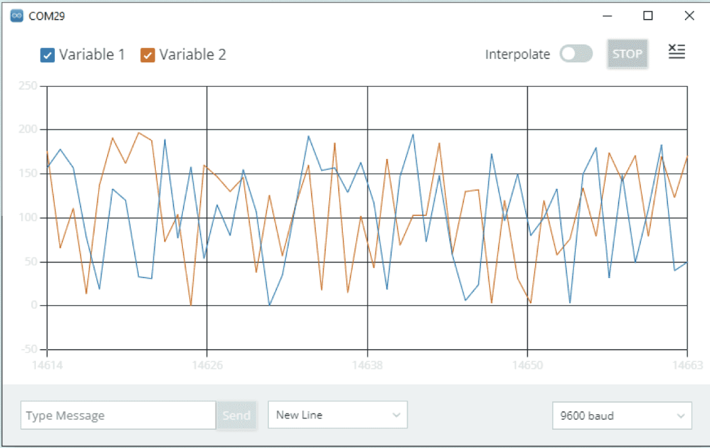
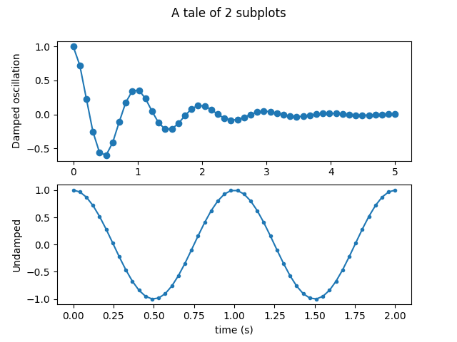
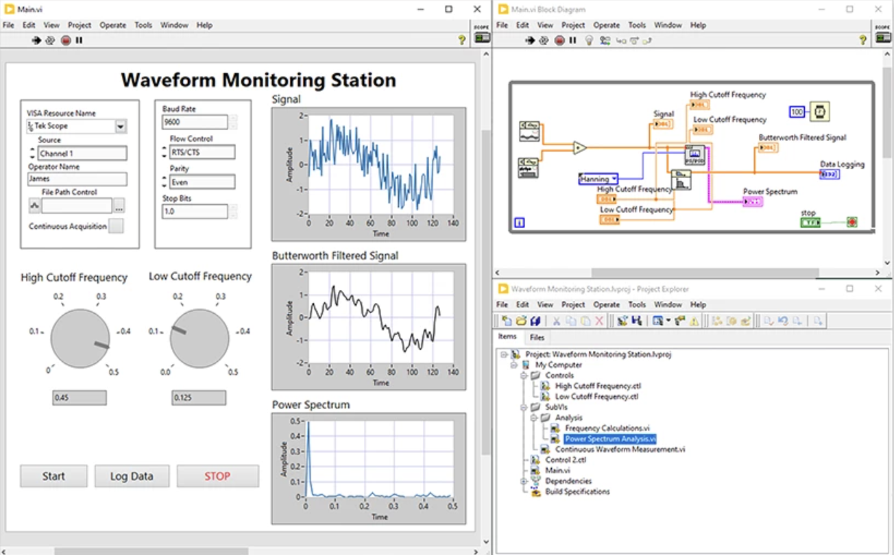

<!-- _class: lead -->
# Diseño e implementación de un sistema de adquisición, transmisión y visualización de datos basado en CanSat
### Sergio García Sánchez — Máster en Ingeniería Informática (UCM)
#### Director: Adrián Riesco Rodríguez

<!-- _notes: Presentación de 25 minutos. Agradece al tribunal. Expón el hilo narrativo: problema → propuesta → validación. -->

---

## Índice

1. **Introduction** 

2. **Objectives** 

3. **Herramientas de visualización**  

4. **Diseño y arquitectura**  

5. **Implementación (embebido, backend, frontend)**  

6. **Validación y resultados**  

7. **Conclusiones y trabajo futuro**  

8. **Demo / Q&A**  

---

## 1. Introduction

This project presents the **design and implementation** of a complete system for:

- Building a **CanSat-like device** with sensors, GNSS and camera  
- Sending data in real time via **WiFi** or **LoRa radio**  
- Displaying telemetry, position, attitude, and video in a **reusable web interface**

---

### What is a CanSat?

  

    <ul>
      <li>Miniature satellite with the approximate size of a soda can (66 mm diameter × 115 mm height)</li>
      <li>Equipped with sensors, onboard computer, power supply, radio system, and parachute</li>
      <li>Launched from rockets or drones to simulate a space mission, typically from 500 – 1000 m altitude</li>
      <li>Widely used for educational purposes and in competitions (ESA CanSat, NASA CanSat)</li>
    </ul>
  

  

---

### Motivation

- Existing CanSat projects focus mainly on hardware and electronics  
- Data visualization is often ad-hoc, not reusable  
- Lack of an easy-to-deploy **modular web platform** for telemetry and video  
---
## 2. Objectives – CanSat

- Build a **CanSat (66 × 115 mm, 300–350 g)** with:
  - GPS receiver  
  - Camera for live video  
  - Barometric sensor for pressure/altitude  
  - IMU for attitude  
  - Battery with solar charging option  

- Send data in real time:
  - **WiFi** when available  
  - **LoRa radio** as fallback (with ground station)

---
## 2. Objectives – Web Platform

- Provide a **modular, reusable platform** for:
  - Live telemetry and last values  
  - Real-time charts of sensor data  
  - GNSS position on a map  
  - 3D attitude model  
  - Live video streaming  
  - Data export for analysis
---

## 3. Herramientas de visualización

  

    
<strong>SerialPlot:</strong> visor de puerto serie para ver y graficar datos en tiempo real desde Arduino IDE.

    
  

  

    
<strong>Matplotlib / PyQtGraph:</strong> librerías de Python para generar gráficos.

    
  

---

  

    
<strong>Excel / Google Sheets:</strong> hojas de cálculo para calcular y graficar datos, no soporta streaming.

    
  

  

    
<strong>LabVIEW:</strong> entorno gráfico de National Instruments para adquisición de datos y control.

    
  

---

## 3. Fundamentos (Hardware)

<table class="table-compact">
  <thead>
    <tr>
      <th>Plataforma</th><th>CPU / Vel.</th><th>RAM</th>
      <th>Conectividad</th><th>Consumo</th><th>Comentario</th>
    </tr>
  </thead>
  <tbody>
    <tr>
      <td><strong>Arduino Nano</strong></td>
      <td>ATmega328P @ 16 MHz</td>
      <td>2 KB SRAM</td>
      <td>UART, I²C, SPI</td>
      <td>~20–30 mA</td>
      <td>Sin SO; no vídeo</td>
    </tr>
    <tr>
      <td><strong>ESP32-WROOM</strong></td>
      <td>Dual-core Xtensa @ 240 MHz</td>
      <td>520 KB SRAM</td>
      <td>WiFi, BT, UART, I²C, SPI</td>
      <td>~80–240 mA (WiFi)</td>
      <td>Conectado, sin cámara HD</td>
    </tr>
    <tr>
      <td><strong>RPi Zero 2 W</strong></td>
      <td>Quad-core A53 @ 1 GHz</td>
      <td>512 MB LPDDR2</td>
      <td>WiFi, BT, USB, UART, I²C, SPI, CSI</td>
      <td>~100–300 mA</td>
      <td>Linux, cámara CSI, multitarea</td>
    </tr>
  </tbody>
</table>

---
## 3. Fundamentos – SPI

- **Serial Peripheral Interface (SPI)**  
- Comunicación **síncrona y full-dúplex**  
- Arquitectura **primario-secundario**, un primario y uno o varios secundarios  
- 4 líneas:
  - CLK (reloj)
  - CS (selección de chip)
  - MOSI (datos primario → secundario)
  - MISO (datos secundario → primario)
- Velocidad típica: **1–10 Mbps** (puede ser mayor)
- Puede usar modo regular (CS dedicado) o modo cadena (*daisy-chain*)

*(Ideal mostrar esquema de SPI: primario + secundarios y las 4 líneas)*

---

## 3. Fundamentos – I²C

- **Inter-Integrated Circuit (I²C)**  
- Comunicación **síncrona y half-dúplex**  
- Arquitectura **primario-secundario**  
- 2 líneas compartidas:
  - SDA (datos)
  - SCL (reloj)
- Cada dispositivo tiene **dirección única**  
- Velocidades típicas:
  - 100 kbit/s (Standard)
  - 400 kbit/s (Fast)
  - 1 Mbit/s (Fm+)
  - hasta 3.4 Mbit/s (Hs-mode)

*(Ideal mostrar diagrama de un primario y varios secundarios en bus común)*

---

## 3. Fundamentos – UART

- **Universal Asynchronous Receiver-Transmitter (UART)**  
- Comunicación **asíncrona**, no necesita reloj compartido  
- Arquitectura **punto a punto**  
- 2 líneas:
  - TX (transmisión)
  - RX (recepción)
- Comunicación **full-dúplex**  
- Velocidad: 9 600 – 115 200 baudios típicos, hasta 1–2 Mbps  
- Cada byte incluye bit de inicio, datos, paridad opcional y bits de parada

*(Ideal mostrar diagrama: TX↔RX entre dos dispositivos)*

---

## 3. Fundamentos – Comparativa de interfaces

| Característica        | SPI             | I²C                    | UART             |
|----------------------|----------------|----------------------|----------------|
| Tipo de comunicación | Síncrona       | Síncrona             | Asíncrona      |
| Arquitectura         | Primario-secundario | Primario-secundario | Punto a punto  |
| Nº de líneas         | 4 (CLK, CS, MOSI, MISO) | 2 (SDA, SCL) | 2 (TX, RX) |
| Dúplex               | Full           | Half                | Full           |
| Nº de dispositivos   | 1 primario, varios secundarios | 1 primario, varios secundarios | Solo dos |
| Velocidad típica     | 1–10 Mbps      | 100 kbit/s – 3.4 Mbps | 9.6 kbit/s – 3 Mbps |
| Control de dirección | Señal CS por secundario | Dirección en protocolo | No necesario |

---

## 3. Fundamentos – Sensor de presión barométrica

- Mide **presión atmosférica** → se calcula altitud usando el modelo ISA  
- A mayor altura, menor presión (relación con densidad del aire)  
- Factores que afectan la precisión: temperatura, humedad, viento  
- Usado para estimar **altura relativa durante el vuelo**

**Ejemplos de sensores comunes:**
| Sensor   | Rango (hPa) | Precisión | Interfaz | Consumo |
|---------|-------------|-----------|---------|---------|
| BMP388  | 300–1250    | ±8 Pa (0.66 m) | I²C/SPI | 3.4 µA |
| BME280  | 300–1100    | ±12 Pa (1 m) | I²C/SPI | 2.7 µA |
| MPL3115A2 | 50–1100   | ±0.04 hPa (0.3 m) | I²C | 40 µA |

---

## 3. Fundamentos – IMU (Inertial Measurement Unit)

- Mide **aceleración** (3 ejes) y **velocidad angular** (3 ejes)  
- Algunos modelos incluyen **magnetómetro** para calcular rumbo  
- Permite conocer la **orientación** en términos de pitch, yaw y roll  
- Modelos avanzados incluyen procesador interno para fusión sensorial

**Ejemplos de IMU:**
| Sensor  | Componentes             | Orientación directa | Interfaz | Consumo |
|--------|------------------------|-------------------|---------|--------|
| MPU6050 | Acc + Giro            | No (procesamiento externo) | I²C | 3.9 mA |
| BNO055 | Acc + Giro + Mag       | Sí (fusión interna) | I²C/UART | 12 mA |
| BNO085 | Acc + Giro + Mag       | Sí (mayor precisión) | I²C/UART/SPI | 3.5 mA |
| LSM9DS1| Acc + Giro + Mag       | No (fusión externa) | I²C/SPI | 1 mA |

---

## 3. Fundamentos – GNSS

- Sistemas: **GPS**, **Galileo**, **GLONASS**, **BeiDou**  
- Un receptor necesita **≥3 satélites** para calcular posición (trilateración)  
- Variables: precisión, frecuencia de actualización, constelaciones soportadas  

**Comparativa de módulos GNSS:**
| Módulo | Constelaciones | Precisión | Actualización | Consumo |
|------|----------------|----------|-------------|--------|
| BN-880 | GPS+Galileo+GLONASS+BeiDou | 2 m CEP | 1–10 Hz | 50 mA @5V |
| NEO-M8N | GPS+Galileo+GLONASS+BeiDou | 2 m CEP | hasta 18 Hz | <150 mA |
| NEO-F9P | +RTK | Centimétrica | hasta 20 Hz | 100 mA @3.3V |

---

## 3. Fundamentos – RTMP

- **Real-Time Messaging Protocol**
- Funciona sobre **TCP** (puerto 1935)
- Establece conexión persistente cliente-servidor
- Multiplexa vídeo, audio y control en chunks
- Latencia típica: **3–5 s**
- Ideal para streaming con baja latencia y buena fiabilidad

---

## 3. Fundamentos – HLS

- **HTTP Live Streaming** (Apple)
- Divide el vídeo en fragmentos de ~6 s (.ts) + playlist (.m3u8)
- Compatible con cualquier servidor HTTP
- Permite **streaming adaptativo** según ancho de banda
- Latencia más alta: **6–30 s**
- Muy usado en streaming web por su simplicidad

---

## 3. Fundamentos – MPEG-DASH

- **Dynamic Adaptive Streaming over HTTP**
- Estándar internacional (ISO/IEC 23009-1)
- Segmenta en fragmentos + manifiesto (.mpd)
- Ajuste dinámico de calidad (bitrate adaptativo)
- Latencia: **4–10 s**
- No está ligado a una implementación propietaria (a diferencia de HLS)

---

## 3. Fundamentos – WebRTC

- **Web Real-Time Communication**
- Funciona sobre **UDP**, baja latencia (<500 ms)
- Comunicación **peer-to-peer** con STUN/TURN
- Soporta cifrado mediante SRTP
- Ideal para videollamadas o streaming en directo
- Más complejo de implementar en sistemas embebidos

---

## 3. Fundamentos – Comparativa de protocolos

| Protocolo | Transporte | Latencia típica | Segmentación |
|----------|------------|----------------|-------------|
| **RTMP** | TCP (1935) | 3–5 s          | Chunks multiplexados |
| **HLS**  | HTTP (TCP) | 5–15 s         | Archivos .ts + playlist |
| **DASH** | HTTP (TCP) | 4–10 s         | MP4 + manifiesto .mpd |
| **WebRTC** | UDP      | <500 ms        | Flujo continuo P2P |

---

## 3. Fundamentos – LoRa

- Tecnología **LPWAN** (Low-Power Wide-Area Network)
- Modulación **Chirp Spread Spectrum (CSS)**
- Configurable: **Spreading Factor (SF)** y **Coding Rate (CR)**
- Incorpora **FEC (Forward Error Correction)** → robusta ante ruido
- Opera en bandas ISM (433/868/915 MHz) → uso libre
- Alcance: **cientos de m en entornos urbanos** hasta **>15 km en campo abierto**
- Velocidad de datos: **0.3 – 27 kbps**

*(Puedes mostrar un diagrama de enlace LoRa CanSat ↔ estación de tierra)*

---

## 3. Fundamentos – XBee (802.15.4)

- Estándar **IEEE 802.15.4** en 2.4 GHz  
- Modulación: **DSSS + O-QPSK** (robusta frente a interferencias)
- Tasa de datos: **250 kbps**
- Modos: **API** (tramas estructuradas) y **transparente** (punto a punto)
- Topologías: punto a punto o estrella
- Alcance típico: **30–100 m en interiores**, >300 m en exteriores
- Interfaz con microcontrolador: **UART**, hasta 1 Mbps

---

## 3. Fundamentos – APC220

- Opera en **433 MHz** (banda ISM)
- Modulación: **GFSK** → menor ancho de banda y emisiones fuera de banda
- Velocidad de datos: **1.2 – 19.2 kbps**
- Interfaz: **UART**
- Incorpora **AGC** y corrección de errores interna
- Alcance: hasta **1 km con visión directa**
- Configuración mediante **comandos AT** o herramienta de PC

---

## 3. Comparativa de tecnologías RF

| Característica       | **LoRa** | **XBee (802.15.4)** | **APC220** |
|--------------------|---------|------------------|-----------|
| Frecuencia         | 433/868/915 MHz | 2.4 GHz | 433 MHz |
| Modulación         | CSS (Chirp Spread Spectrum) | DSSS + O-QPSK | GFSK |
| Velocidad de datos | 0.3–27 kbps | 250 kbps | 1.2–19.2 kbps |
| Alcance típico     | hasta 15 km | 30–300 m | hasta 1 km |
| Corrección errores | FEC (CR 4/5–4/8) | No especificado | FEC + AGC |
| Interfaz MCU       | UART | UART | UART |
| Topología          | Punto a punto | Punto a punto / estrella | Punto a punto |

---

## 4. Diseño e implementación – Arquitectura general

- Sistema dividido en 4 bloques:
  1. **CanSat:** Raspberry Pi Zero 2 W + sensores + cámara  
  2. **Estación de tierra:** Raspberry Pi 4 + receptor LoRa  
  3. **Backend:** Spring Boot + RabbitMQ + PostgreSQL  
  4. **Frontend:** Flutter + WebSocket (STOMP)

*(Incluye aquí el diagrama de arquitectura general con flechas de flujo de datos)*

---

## 4. Diseño e implementación – Hardware

- **Unidad de procesamiento:** Raspberry Pi Zero 2 W (Linux + vídeo H.264)
- **Sensores:**
  - BMP388 (presión y temperatura)
  - BNO085 (IMU con fusión sensorial)
  - BN-880 (GNSS multi-constelación + brújula)
- **Cámara CSI:** captura y codificación de vídeo sin sobrecargar la CPU
- **Transmisión:** WiFi si hay red disponible, LoRa E32-900T20D si no
- **Alimentación:** batería 18650 + cargador MCP73871 + boost converter a 5V

*(Puedes incluir foto del montaje o render 3D del CanSat)*

---

## 4. Diseño e implementación – Estación de tierra y software

- **Estación de tierra:**
  - Raspberry Pi 4 + receptor LoRa
  - Actúa como pasarela → reenvía datos a RabbitMQ
- **Software embebido:**
  - Scripts en Python para adquisición de datos, envío por LoRa/WiFi y recepción
- **Backend:**
  - Spring Boot, API REST, ingesta de eventos y persistencia en PostgreSQL
  - RabbitMQ como broker de eventos (AMQP)
- **Frontend:**
  - Implementado en Flutter
  - Métricas, gráficas, mapa GNSS, modelo 3D, vídeo en tiempo real

---

## 5. Implementación (embebido)

- Código embebido en Raspberry Pi:
  - Lectura de sensores y GNSS
  - Captura de vídeo
  - Envío de telemetría por LoRa o red
- Ejemplo de evento en JSON

---

## 5. Implementación (backend)

- Backend en Spring Boot:
  - Ingesta de eventos desde RabbitMQ
  - Persistencia en base de datos
  - API REST + WebSocket para clientes

---

## 5. Implementación (frontend)

- Frontend en Flutter:
  - Componentes de métricas y gráficas
  - Mapa con posición GNSS
  - Actitud 3D del CanSat
  - Streaming de vídeo
- Capturas de pantalla de la interfaz final

---

## 6. Validación y resultados

- Pruebas realizadas: simulación y sistema real
- Métricas clave: latencia, autonomía, alcance de LoRa
- Visualización en tiempo real durante la validación

---

## 7. Conclusiones y trabajo futuro

- Principales logros: modularidad, reutilización, validación exitosa
- Posibles mejoras:
  - Nuevos sensores
  - Mejoras de interfaz y UX
  - Despliegue en la nube para proyectos colaborativos

---

## 8. Demo / Q&A

- Breve demo del sistema en vivo o vídeo grabado
- Turno de preguntas