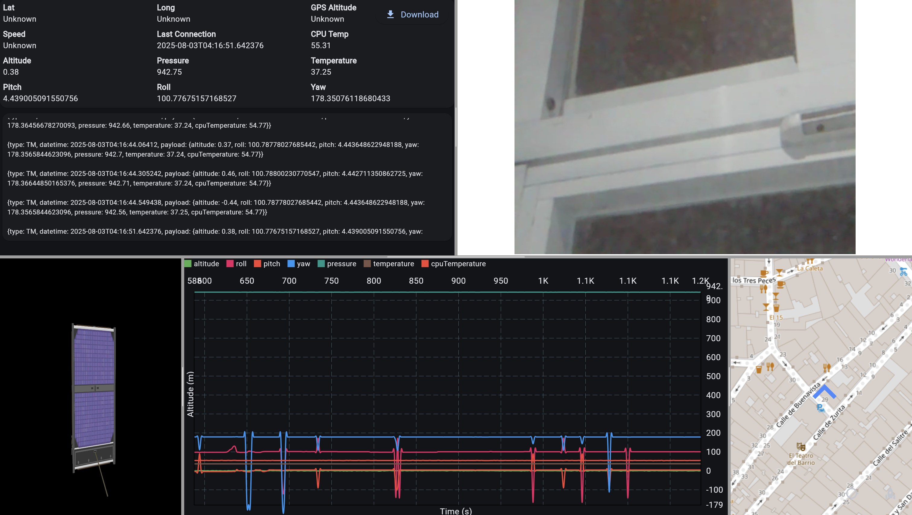

---

marp: true
lang: es
title: "CanSat: sistema de adquisición y datos en tiempo real"
description: "TFM – Sergio García Sánchez"
paginate: true
size: 16:9
theme: default
class: lead
style: |
  :root { --accent: #2563eb; }
  section.lead h1, section.lead h2 { color: var(--accent); }
  section { font-size: 30px; }
  footer { color: #666; font-size: 18px; }
  .title-wrap {
    max-width: 1200px;
    margin: 0 auto;
    text-align: center;
    padding-top: 12px;
  }
  .title-wrap h1 {
    font-size: 60px;
    line-height: 1.12;
    margin: 0 0 18px 0;
    color: var(--accent);
  }
  .title-wrap .meta {
    font-size: 30px;
    line-height: 1.35;
    color: #111;
    margin: 0 0 14px 0;
  }
  .title-wrap .director {
    font-size: 26px;
    color: #333;
    margin: 0;
  }
  .title-wrap .accent {
    width: 88px;
    height: 6px;
    background: var(--accent);
    border-radius: 3px;
    margin: 20px auto 16px;
  }
  .ucm-center {
    display: block;
    margin: 18px auto 0;
    height: 92px;
    object-fit: contain;
    opacity: 0.95;
  }
header: ""
---

<!-- _class: lead -->

  <h1>CanSat: sistema de adquisición y datos en tiempo real</h1>
  
<strong>Sergio García Sánchez</strong>

  

---

## Índice

1. **Introducción**
2. **Objetivos**
3. **Fundamentos y estado del arte**
4. **Diseño y arquitectura**
5. **Validación y resultados**
6. **Conclusiones**
7. **Trabajo futuro**
8. **Preguntas**

---

## 1. Introducción

Este proyecto presenta el **diseño e implementación** de un sistema completo orientado a:

- Desarrollar una **arquitectura reutilizable** para dispositivos tipo CanSat
- Integrar adquisición de datos (sensores, GNSS y cámara) en **distintas plataformas hardware**
- Enviar datos en tiempo real mediante **WiFi** o **radio**
- Visualizar telemetría, posición, actitud y vídeo en una **interfaz web reutilizable**

---

### ¿Qué es un CanSat?

  

    <ul>
      <li>Satélite en miniatura con un tamaño aproximado al de una lata de refresco (66 mm de diámetro × 115 mm de altura)</li>
      <li>Equipado con sensores, ordenador a bordo, sistema de alimentación, comunicaciones por radio y paracaídas</li>
      <li>Lanzado desde cohetes o drones para simular una misión espacial, normalmente desde altitudes de 500 a 1000 m</li>
      <li>Ampliamente utilizado con fines educativos y en competiciones (ESA CanSat, NASA CanSat)</li>
    </ul>
  

  

---

### Motivación

- Muchos proyectos CanSat se centran principalmente en el **hardware y la electrónica**, dejando el sistema software en un segundo plano
- La visualización de datos suele ser **ad hoc**, poco estructurada y difícil de reutilizar entre proyectos
- No existe una **arquitectura común**, modular y fácilmente desplegable, para la gestión de telemetría y vídeo en tiempo real

---
## 2. Objetivos – CanSat

- Diseñar e implementar **dos CanSat funcionales**, basados en:
  - **ESP32**, orientado a bajo consumo y telemetría
  - **Raspberry Pi**, con mayor capacidad de proceso y soporte de vídeo
- Integrar adquisición de datos mediante:
  - Receptor GNSS
  - Sensores ambientales (presión/altitud)
  - IMU para estimación de la actitud
  - Cámara para vídeo en tiempo real
- Enviar los datos en tiempo real mediante:
  - **WiFi**, cuando hay red disponible
  - **Radio LoRa** como mecanismo alternativo, junto con una estación de tierra

---
## 2. Objetivos – Plataforma web

- Proporcionar una **plataforma modular y reutilizable** que permita:
  - Visualización de telemetría en tiempo real y últimos valores
  - Gráficas en tiempo real de los datos de los sensores
  - Posición GNSS sobre un mapa
  - Modelo 3D de la actitud
  - Streaming de vídeo en tiempo real
  - Exportación de datos para su análisis posterior

---

## 3. Fundamentos - Herramientas de visualización

  

    
<strong>SerialPlot:</strong> visor de puerto serie para ver y graficar datos en tiempo real desde Arduino IDE.

    
  

  

    
<strong>Matplotlib / PyQtGraph:</strong> librerías de Python para generar gráficos.

    
  

---

  

    
<strong>Excel / Google Sheets:</strong> hojas de cálculo para calcular y graficar datos, no soporta streaming.

    
  

  

    
<strong>LabVIEW:</strong> entorno gráfico de National Instruments para adquisición de datos y control.

    
  

---

## 3. Fundamentos - Microcontroladores

<table class="table-compact">
  <thead>
    <tr>
      <th>Característica</th>
      <th>Raspberry Pi Zero 2 W</th>
      <th>ESP32</th>
      <th>Arduino Nano</th>
    </tr>
  </thead>
  <tbody>
    <tr>
      <td><strong>Procesador</strong></td>
      <td>ARM Cortex-A53 (4×, 1&nbsp;GHz)</td>
      <td>Xtensa LX6 (2×, 240&nbsp;MHz)</td>
      <td>ATmega328P (1×, 16&nbsp;MHz)</td>
    </tr>
    <tr>
      <td><strong>Memoria</strong></td>
      <td>512&nbsp;MB SDRAM</td>
      <td>520&nbsp;KB SRAM + 4&nbsp;MB Flash</td>
      <td>2&nbsp;KB SRAM + 32&nbsp;KB Flash</td>
    </tr>
    <tr>
      <td><strong>Wi-Fi</strong></td>
      <td>Sí</td>
      <td>Sí</td>
      <td>No</td>
    </tr>
    <tr>
      <td><strong>Bluetooth</strong></td>
      <td>4.2 + BLE</td>
      <td>4.2 + BLE</td>
      <td>No</td>
    </tr>
    <tr>
      <td><strong>SPI</strong></td>
      <td>1</td>
      <td>4</td>
      <td>1</td>
    </tr>
    <tr>
      <td><strong>I²C</strong></td>
      <td>2</td>
      <td>2</td>
      <td>1</td>
    </tr>
    <tr>
      <td><strong>UART</strong></td>
      <td>1</td>
      <td>3</td>
      <td>1</td>
    </tr>
    <tr>
      <td><strong>Compatibilidad cámara</strong></td>
      <td>CSI (cámara oficial)</td>
      <td>OV2640 (ESP32-CAM)</td>
      <td>No</td>
    </tr>
    <tr>
      <td><strong>Consumo típico</strong></td>
      <td>0.7–1.5&nbsp;W</td>
      <td>0.2–0.6&nbsp;W</td>
      <td>0.05–0.2&nbsp;W</td>
    </tr>
    <tr>
      <td><strong>Precio estimado</strong></td>
      <td>15–20&nbsp;€</td>
      <td>4–8&nbsp;€</td>
      <td>25–30&nbsp;€</td>
    </tr>
  </tbody>
</table>

---

## 3. Fundamentos – Interfaces de comunicación

<table class="table-serial">
  <thead>
    <tr>
      <th>Característica</th>
      <th>SPI</th>
      <th>I²C</th>
      <th>UART</th>
    </tr>
  </thead>
  <tbody>
    <tr>
      <td>Tipo de comunicación</td>
      <td>Síncrona</td>
      <td>Síncrona</td>
      <td>Asíncrona</td>
    </tr>
    <tr>
      <td>Arquitectura</td>
      <td>Primario–secundario</td>
      <td>Primario–secundario</td>
      <td>Punto a punto</td>
    </tr>
    <tr>
      <td>Nº de líneas</td>
      <td>4 (CLK, CS, MOSI, MISO)</td>
      <td>2 (SDA, SCL)</td>
      <td>2 (TX, RX)</td>
    </tr>
    <tr>
      <td>Dúplex</td>
      <td>Full</td>
      <td>Half</td>
      <td>Full</td>
    </tr>
    <tr>
      <td>Nº de dispositivos</td>
      <td>1 primario, varios secundarios</td>
      <td>1 primario, varios secundarios</td>
      <td>Solo dos</td>
    </tr>
    <tr>
      <td>Velocidad típica</td>
      <td>1–10&nbsp;Mbps</td>
      <td>100&nbsp;kbit/s – 3.4&nbsp;Mbps</td>
      <td>9.6&nbsp;kbit/s – 3&nbsp;Mbps</td>
    </tr>
    <tr>
      <td>Control de dirección</td>
      <td>Señal CS por secundario</td>
      <td>Dirección en protocolo</td>
      <td>No necesario</td>
    </tr>
  </tbody>
</table>

---

## 3. Fundamentos – Comunicación por radiofrecuencia

<table class="table-rf">
  <thead>
    <tr>
      <th>Característica</th>
      <th>LoRa</th>
      <th>XBee (802.15.4)</th>
      <th>APC220</th>
    </tr>
  </thead>
  <tbody>
    <tr>
      <td>Frecuencia</td>
      <td>433 / 868 / 915 MHz</td>
      <td>2.4 GHz</td>
      <td>433 MHz</td>
    </tr>
    <tr>
      <td>Modulación</td>
      <td>CSS (Chirp Spread)</td>
      <td>DSSS + O-QPSK</td>
      <td>GFSK</td>
    </tr>
    <tr>
      <td>Velocidad de datos</td>
      <td>0.3–27 kbps</td>
      <td>250 kbps</td>
      <td>1.2–19.2 kbps</td>
    </tr>
    <tr>
      <td>Alcance típico</td>
      <td>hasta 15 km</td>
      <td>30–300 m</td>
      <td>hasta 1 km</td>
    </tr>
    <tr>
      <td>Corrección errores</td>
      <td>FEC (CR 4/5–4/8)</td>
      <td>No especificado</td>
      <td>FEC + AGC</td>
    </tr>
    <tr>
      <td>Interfaz MCU</td>
      <td>UART</td>
      <td>UART</td>
      <td>UART</td>
    </tr>
  </tbody>
</table>

---

## 3. Fundamentos – Sensor de presión barométrica

- Mide **presión atmosférica** → se calcula altitud usando el modelo ISA
- A mayor altura, menor presión (relación con densidad del aire)
- Factores que afectan la precisión: temperatura, humedad, viento
- Usado para estimar **altura relativa durante el vuelo**

**Ejemplos de sensores comunes:**

<table class="table-compact">
  <thead>
    <tr>
      <th>Sensor</th>
      <th>Rango de presión</th>
      <th>Precisión</th>
      <th>Interfaz</th>
      <th>Consumo</th>
      <th>Precio</th>
    </tr>
  </thead>
  <tbody>
    <tr>
      <td><strong>BMP388</strong></td>
      <td>300–1250 hPa</td>
      <td>±8 Pa (±0,66 m)</td>
      <td>I²C / SPI</td>
      <td>3.4 µA</td>
      <td>~3,50 €</td>
    </tr>
    <tr>
      <td><strong>BME280</strong></td>
      <td>300–1100 hPa</td>
      <td>±12 Pa (±1 m)</td>
      <td>I²C / SPI</td>
      <td>2.7 µA</td>
      <td>~4,00 €</td>
    </tr>
    <tr>
      <td><strong>MPL3115A2</strong></td>
      <td>50–1100 hPa</td>
      <td>±0,04 hPa (±0,3 m)</td>
      <td>I²C</td>
      <td>40 µA</td>
      <td>~6,00 €</td>
    </tr>
  </tbody>
</table>

---

## 3. Fundamentos – IMU (Inertial Measurement Unit)

- Mide **aceleración** (3 ejes) y **velocidad angular** (3 ejes)
- Algunos modelos incluyen **magnetómetro** para calcular rumbo
- Permite conocer la **orientación** en términos de pitch, yaw y roll
- Modelos avanzados incluyen procesador interno para fusión sensorial

**Sensores IMU:**

<table class="table-compact">
  <thead>
    <tr>
      <th>Sensor</th>
      <th>Componentes</th>
      <th>Salida de orientación</th>
      <th>Interfaz</th>
      <th>Consumo</th>
      <th>Precio</th>
    </tr>
  </thead>
  <tbody>
    <tr>
      <td><strong>MPU6050</strong></td>
      <td>Acelerómetro + Giroscopio</td>
      <td>No (requiere fusión externa)</td>
      <td>I²C</td>
      <td>3.9 mA</td>
      <td>~1,50 €</td>
    </tr>
    <tr>
      <td><strong>BNO055</strong></td>
      <td>Acelerómetro + Giroscopio + Magnetómetro</td>
      <td>Sí (fusión interna)</td>
      <td>I²C / UART</td>
      <td>12 mA</td>
      <td>~9,00 €</td>
    </tr>
    <tr>
      <td><strong>BNO085</strong></td>
      <td>Acelerómetro + Giroscopio + Magnetómetro</td>
      <td>Sí (mayor precisión)</td>
      <td>I²C / UART / SPI</td>
      <td>3.5 mA</td>
      <td>~14,00 €</td>
    </tr>
  </tbody>
</table>

---

## 3. Fundamentos – GNSS

- Sistemas: **GPS**, **Galileo**, **GLONASS**, **BeiDou**
- Un receptor necesita **≥3 satélites** para calcular posición (trilateración)
- Variables: precisión, frecuencia de actualización, constelaciones soportadas

**Comparativa de módulos GNSS:**

<table class="table-gnss">
  <thead>
    <tr>
      <th>Módulo</th>
      <th>Constelaciones</th>
      <th>Precisión típica</th>
      <th>Frecuencia</th>
      <th>Consumo</th>
      <th>Precio</th>
    </tr>
  </thead>
  <tbody>
    <tr>
      <td>BN-880</td>
      <td>GPS, GLONASS, Galileo, BeiDou</td>
      <td>~2 m CEP</td>
      <td>1–10 Hz</td>
      <td>50 mA @ 5V</td>
      <td>15–25 €</td>
    </tr>
    <tr>
      <td>NEO-M8N</td>
      <td>GPS, GLONASS, Galileo, BeiDou</td>
      <td>~2 m CEP</td>
      <td>1–18 Hz</td>
      <td>&lt;150 mA @ 5V</td>
      <td>35–40 €</td>
    </tr>
    <tr>
      <td>NEO-F9P</td>
      <td>GPS, GLONASS, Galileo, BeiDou (RTK)</td>
      <td>cm-level (con RTK)</td>
      <td>hasta 20 Hz</td>
      <td>100 mA @ 3.3V</td>
      <td>110–130 €</td>
    </tr>
  </tbody>
</table>

<!-- ---

## 3. Fundamentos – Protocolos de transmisión de video

| Protocolo | Transporte | Latencia típica | Segmentación |
|----------|------------|----------------|-------------|
| **RTMP** | TCP (1935) | 3–5 s          | Chunks multiplexados |
| **HLS**  | HTTP (TCP) | 5–15 s         | Archivos .ts + playlist |
| **DASH** | HTTP (TCP) | 4–10 s         | MP4 + manifiesto .mpd |
| **WebRTC** | UDP      | <500 ms        | Flujo continuo P2P | -->

---

## 4. Diseño e implementación – Hardware

Se han desarrollado **dos CanSat** usando distintos controladores:

- **CanSat basado en ESP32**
  - Unidad de procesamiento: ESP32
  - Sensores:
    - BMP388 (presión y temperatura)
    - BNO085 (IMU con fusión sensorial)
  - Transmisión: LoRa (SX1278)

- **Estación de tierra**
  - Receptor LoRa  (SX1278)

---

- **CanSat basado en Raspberry Pi**
  - Unidad de procesamiento: Raspberry Pi Zero 2 W
  - Sensores:
    - BMP388 (presión y temperatura)
    - BNO085 (IMU con fusión sensorial)
    - BN-880 (GNSS multi-constelación)
  - Cámara CSI: Raspberry Pi Camera Module v2
  - Transmisión: WiFi y LoRa (E32-900T20D)
  - Alimentación: batería 18650 + cargador MCP73871 + convertidor boost a 5 V
- **Estación de tierra**
  - Raspberry Pi 4
  - Receptor LoRa

---

## 4. Selección de tecnologías – Software

- **Software embebido:**
    - Scripts en Python para lectura de sensores, GNSS, captura de vídeo y envío de datos

- **Backend:**
    - Spring Boot (Java) + API REST
    - RabbitMQ (AMQP) para mensajería de eventos
    - PostgreSQL para persistencia

- **Frontend:**
    - Desarrollado en **Flutter**
    - Comunicación en tiempo real mediante WebSocket

---

## 4. Selección de tecnologías – Arquitectura general CanSat Raspberry Pi

---

## 4. Selección de tecnologías – Arquitectura general CanSat ESP32

---

## 4. Selección de tecnologías – Conexión - Raspberry Pi

  
  

---

## 4. Selección de tecnologías – Conexión - Raspberry Pi

  
  

---

## 4. Selección de tecnologías – Conexión - Raspberry Pi

  
  

---

## 4. Selección de tecnologías – Conexión - Esp32

---

## 4. Selección de tecnologías – Interfaz

  

---

## 5. Pruebas – Integración con datos simulados

- **Objetivo:** validar backend y frontend **sin hardware**
- **Telemetría simulada (Python + RabbitMQ):**
    - Publicación periódica de eventos JSON (altitud, temperatura, GNSS, actitud)
    - Verificación de ingesta, persistencia y actualización **en tiempo real** (métricas, gráficas, mapa)
- **Vídeo simulado (Python + FFmpeg → RTMP):**
    - Generación de frames sintéticos y envío a **servidor RTMP**
    - Reproducción en el **frontend** con baja latencia

---

## 5. Pruebas – Sistema real (CanSat + Estación + Servicios)

- **Transmisión por WiFi:**  
  Eventos → RabbitMQ → PostgreSQL → WebSocket → Frontend  
  **Latencia < 1 s** desde la generación a la visualización

- **Transmisión por LoRa (868 MHz):**  
  Recepción estable en campo abierto **hasta > 1 km**  
  Pérdidas ocasionales a distancias superiores (acorde al módulo empleado)

- **Autonomía energética:** ≈ **2 h** de operación continua con telemetría + vídeo

- **Persistencia y exportación:**  
  Datos en **PostgreSQL** y descarga en **JSONL** vía API

<!-- ---

## 5. Resultados (resumen)

<table class="table-tests">
  <thead>
    <tr>
      <th>Prueba</th>
      <th>Resultado</th>
    </tr>
  </thead>
  <tbody>
    <tr>
      <td>Transmisión por WiFi</td>
      <td>Latencia < 1 s, integración end-to-end correcta</td>
    </tr>
    <tr>
      <td>Transmisión por LoRa</td>
      <td>Recepción estable hasta > 1 km (campo abierto)</td>
    </tr>
    <tr>
      <td>Autonomía</td>
      <td>≈ 2 h de operación continua (telemetría + vídeo)</td>
    </tr>
    <tr>
      <td>Persistencia/Exportación</td>
      <td>Datos en PostgreSQL y descarga en JSONL vía API</td>
    </tr>
  </tbody>
</table> -->

---

## 6. Conclusiones

- **Objetivo cumplido:** se ha desarrollado una plataforma reutilizable e independiente del hardware para la visualización de datos de un CanSat en tiempo real.
- **Arquitectura modular:** adquisición de datos, transmisión, backend y frontend desacoplados, lo que permite cambios independientes y facilita el mantenimiento y la reutilización.
- **Validación del sistema:** implementación de un CanSat real, demostrando la independencia del hardware y la adaptabilidad a distintos sensores y configuraciones.
- **Gestión del vídeo (Raspberry Pi Zero 2 W):** se detectaron limitaciones de estabilidad, solventadas mediante resolución 640×480 a 15 fps y uso de FFmpeg con aceleración por hardware, obteniendo un flujo de vídeo continuo y estable.

---

## 7. Trabajo futuro

- Incorporar más **gráficas en tiempo real** y visualizaciones personalizadas
- Implementar un **sistema de telemandos** para el control remoto de sensores y parámetros de configuración
- Añadir **mecanismos de autenticación** para proteger el acceso a datos sensibles
- Dar soporte a la monitorización simultánea de **múltiples CanSats**

---

  <h1>Preguntas</h1>
  
CanSat: sistema de adquisición y datos en tiempo real

  
Sergio García Sánchez

  

    GitHub: <a href="https://github.com/tronxi/cansat">github.com/tronxi/cansat</a>
  

  
Gracias por su atención

